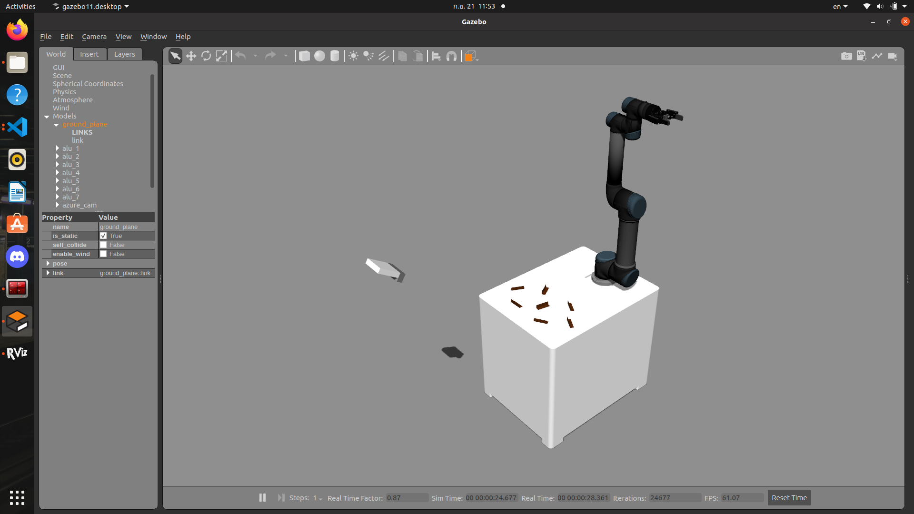
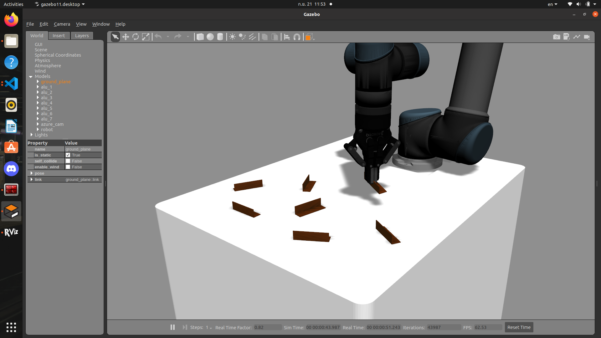
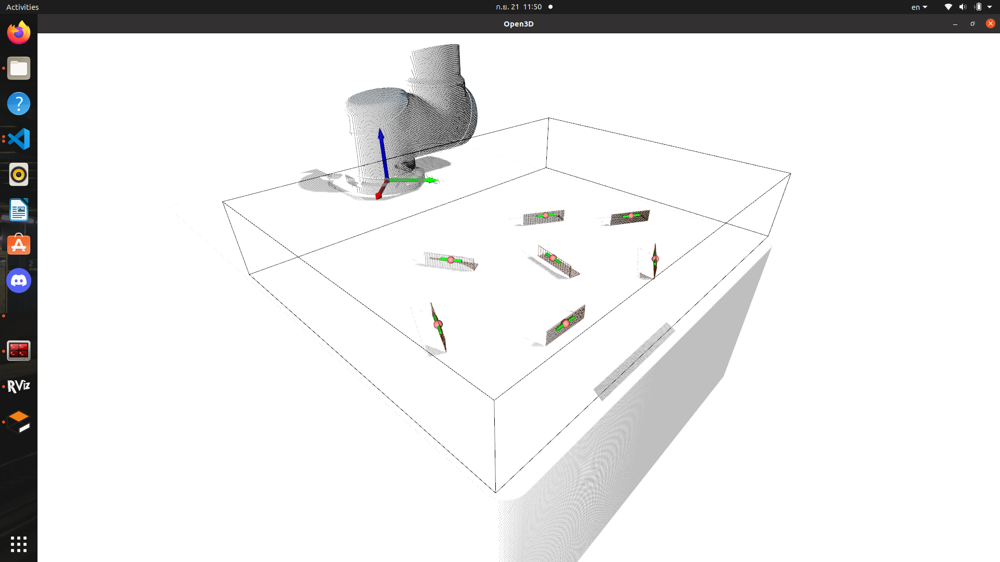
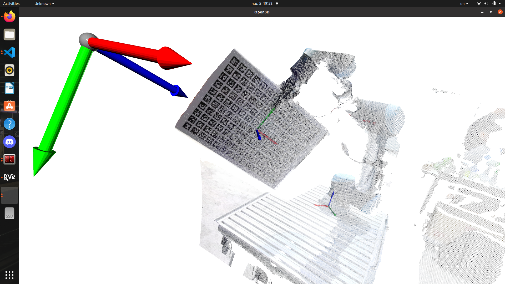
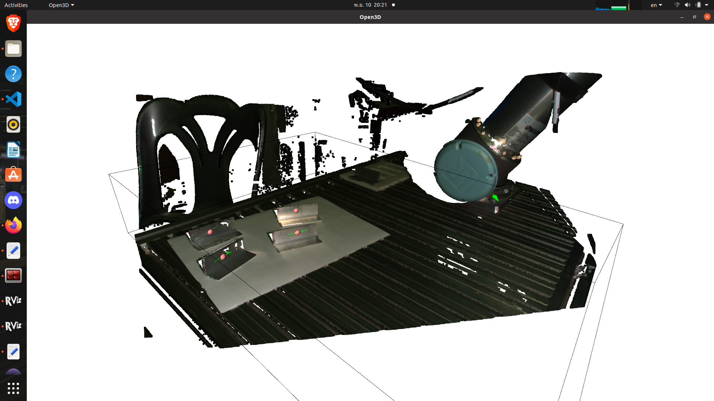

# bin picking project
git clone into workspace src and make require universal_robot package for real hardware

Need to add models path into .bashrc file
```
export GAZEBO_RESOURCE_PATH=~/RobotArm_ws/src/models:${GAZEBO_RESOURCE_PATH}
export GAZEBO_MODEL_PATH=~/RobotArm_ws/src/models:${GAZEBO_MODEL_PATH}
```

# Usage
launch the gazebo simulation world


```
roslaunch bin_picking simulation_binpicking.launch 
```
run pickandplace node (Change process_now variable in code to "process_now = 'sim'")



```
rosrun bin_picking pickandplace.py
```

# For connect to real hardware 
Need to git clone https://github.com/ros-industrial/universal_robot.git which provide the ur5 bringup file 
but need to modifiy some code in additionally to control arm&gripper
```
roslaunch ur_modern_driver ur5_robotiq85_bringup.launch robot_ip:=192.168.0.100
```

# With Gripper
```
roslaunch ur5_armgripper_hardware move_group.launch
roslaunch ur5_armgripper_hardware moveit_rviz.launch
```

# UR5 base
```
roslaunch my_ur5_moveit_config ur5_moveit_planning_execution.launch
roslaunch my_ur5_moveit_config moveit_rviz.launch config:=True
```

# With Camera
```
roslaunch model3d zivid_run.launch
```

# connect gripper
```
sudo chmod 666 /dev/ttyUSB0 
rosrun robotiq_2f_gripper_control Robotiq2FGripperRtuNode.py /dev/ttyUSB0
```

# manual control for gripper 
```
rosrun robotiq_2f_gripper_control Robotiq2FGripperSimpleController.py
```

# run system



```
rosrun bin_picking RobotOriginCalibration.py
rosrun bin_picking pickandplace.py
```

# Model scaning with UR5

```
rosrun bin_picking arm_model.py 
```

