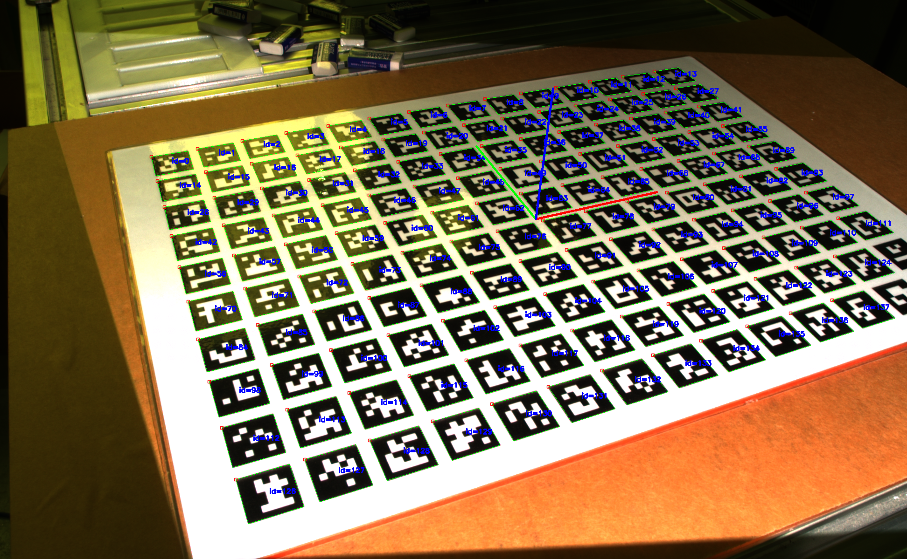
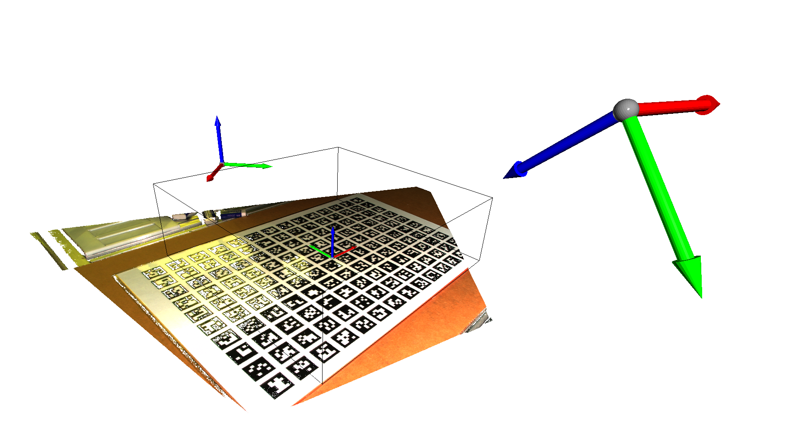
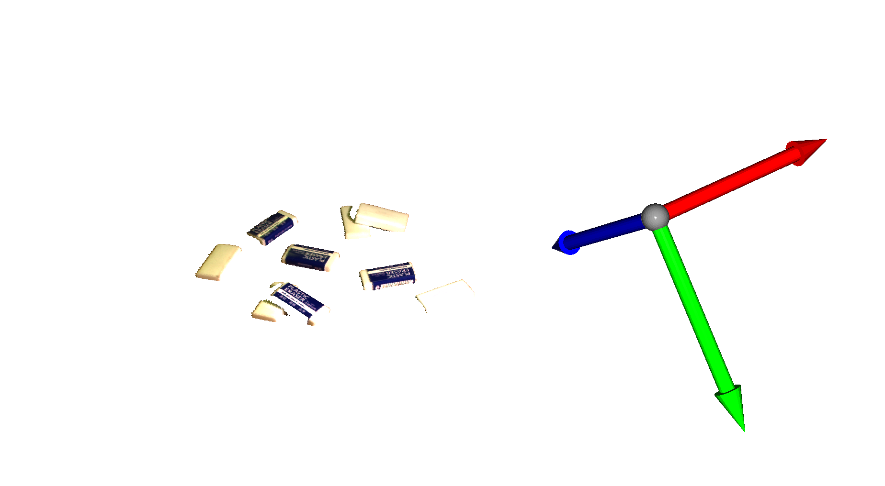
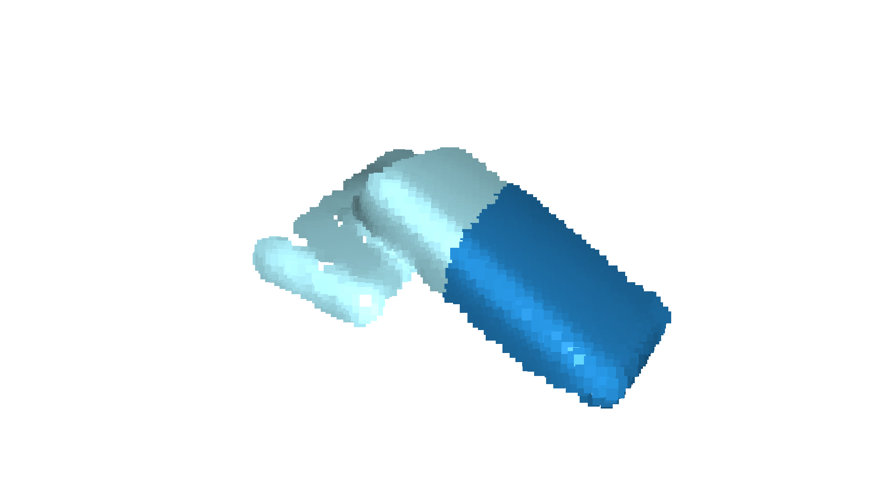
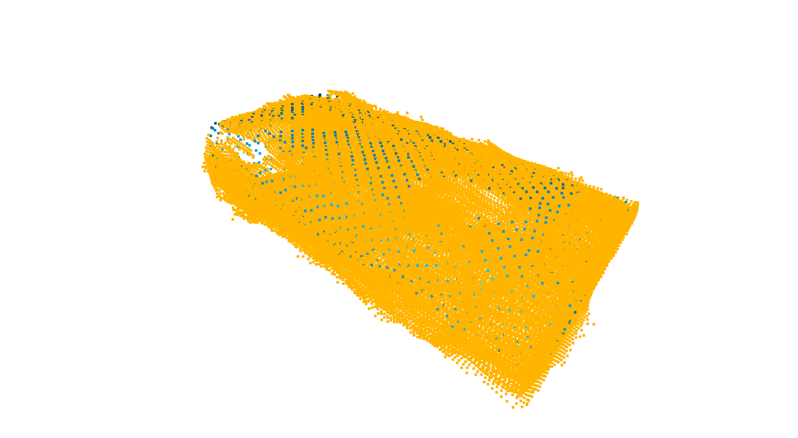
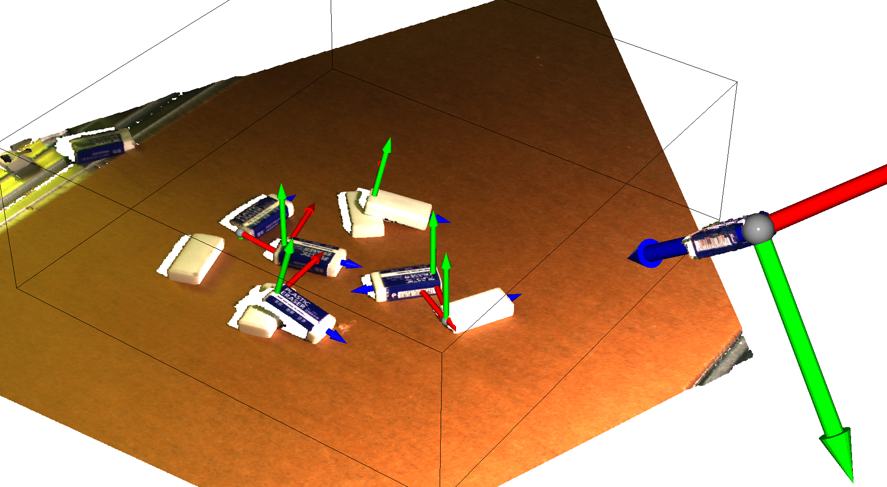
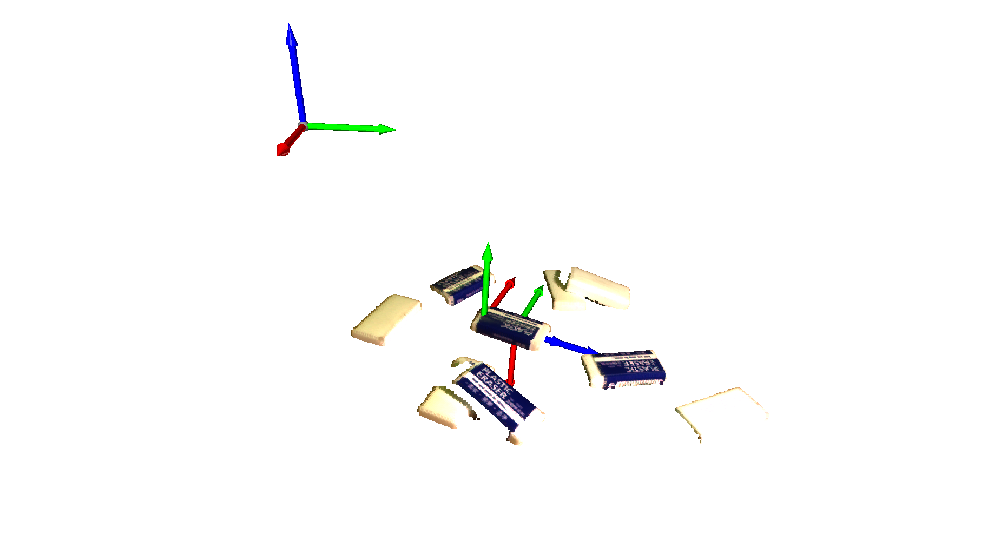

# Bin Picking Project
Testing a bin-picking system using both simulation and real hardware is an important step in the development and deployment of such a system. Simulation allows for rapid prototyping and testing of the system's algorithms and control strategies without the need for costly physical hardware. However, it is also essential to validate the system's performance on real hardware, including the robot and sensors, to ensure that it will operate correctly in the intended environment.

In this project, we will be testing a bin-picking system using an UR5 robot and a Zivid Two depth camera. The UR5 robot will be used to execute the motion of the bin-picking system, while the Zivid Two depth camera will provide 3D vision for object detection and localization. We will use simulation to test and refine the system's algorithms and control strategies, and then validate the system's performance on the real hardware. This dual approach will allow us to optimize the system's performance and reliability before deployment.

git clone into workspace src and make require universal_robot package for real hardware

### :: Require following package ::

Action format : https://github.com/Oongking/config_ws/tree/main/action_command

Zivid connection : https://github.com/zivid/zivid-ros

UR5 model : https://github.com/ros-industrial/universal_robot

UR5 connection : https://github.com/ros-industrial/ur_modern_driver

# Simulation
Need to add models path into .bashrc file
```
export GAZEBO_RESOURCE_PATH=~/RobotArm_ws/src/models:${GAZEBO_RESOURCE_PATH}
export GAZEBO_MODEL_PATH=~/RobotArm_ws/src/models:${GAZEBO_MODEL_PATH}
```

launch the gazebo simulation world


```
roslaunch bin_picking simulation_binpicking.launch 
```
run pickandplace node (Change cam_type variable in the code to "cam_type = 'sim'")


```
rosrun bin_picking pickandplace.py
rosrun bin_picking arm_action_server.py
```
# Hardware Test

### Connect moveit to Ur5
```
roslaunch bin_picking real_hardware.launch 
```
### Start control Ur5 & Gripper with Joystick
```
roslaunch bin_picking real_servo.launch 
```

  | Button | Description | Button | Description |
  | --- | --- | --- | --- |
  | `Up` | Robot go **+X** | `Triangle` | Robot **Mode Toggle** between Cartesian&Invert |
  | `Down` | Robot go **-X** | `Cross` | Gripper **Release Open** |
  | `Right` | Robot go **-Y** | `Circle` | Robot **Speed Toggle** between Slow&Speed |
  | `Left` | Robot go **+Y** | `Square` | Gripper **Half Open** |
  | `L1` | Gripper **Full Open** | `R1` | Gripper **Full Close** |
  | `L2` | Robot heading go **Z** | `R2` | Robot heading go **-Z** |
  | `Select` | **Reset** Gripper | `Start` | **Activate** Gripper |

  | Analog | Description | Analog | Description |
  | --- | --- | --- | --- |
  | `Left X analog` | Robot rotate around **+-X** axis | `Right X analog` | Robot heading go **+-Z** |
  | `Left Y analog` | Robot rotate around **+-Y** axis | `Right Y analog` | **NOT IN USE** |
  
  
### Calibration Robotpose
<p align="center">
  
</p>

```
rosrun bin_picking RobotOriginCalibration.py
```
### Start picking operation
```
roslaunch bin_picking pickandplace.launch 
```
Then set workspace that will operate by using ArUco and preciew the process workspace


### Example :: Eraser

After crop object in workspace the eraser would have average point of ~700 point. To saperate each eraser we divide the input point with eraser point and segment by using K-means method. which not the best technique but with only pointcloud processing, this method can greatly speed up the following step's processing.
<p align="center">

  
  
  
</p>

  Then use Iterative closest point (ICP) algorithm to align the detected object with a pre-defined model of the object. ICP is a method that iteratively minimizes the distance between corresponding points on the object and model by optimizing the transformation between them. By using ICP to align the detected object with the model, we can reduce the error introduced by noise and variability in the object pose estimation.
  
<p align="center">

  
  
  
</p>

After obtaining the object position. The selection is to pick the position that ICP have highest fitness value. We offset the pick position in relation to the pre-defined model.
<p align="center">
  
</p>


# Each Section
### For connect to real hardware 
Need to git clone https://github.com/ros-industrial/universal_robot.git which provide the ur5 bringup file 
but need to modifiy some code in additionally to control arm&gripper
```
roslaunch ur_modern_driver ur5_robotiq85_bringup.launch robot_ip:=192.168.0.100
```
___- UR5 base with gripper model___  : Prepare moveit with ur5 model that including Robotiq Gipper

```roslaunch ur5_armgripper_hardware move_group.launch```

```roslaunch ur5_armgripper_hardware moveit_rviz.launch```

___- UR5 base without gripper model___ : Standard moveit

```roslaunch my_ur5_moveit_config ur5_moveit_planning_execution.launch```

```roslaunch my_ur5_moveit_config moveit_rviz.launch config:=True```

### Zivid Camera
```
roslaunch model3d zivid_run.launch
```

### Connection with Robotiq gripper
```
sudo chmod 666 /dev/ttyUSB0 
rosrun robotiq_2f_gripper_control Robotiq2FGripperRtuNode.py /dev/ttyUSB0
```
___- Manual control for gripper___

```rosrun robotiq_2f_gripper_control Robotiq2FGripperSimpleController.py```

### Model scaning with UR5
```
rosrun bin_picking arm_model.py 
```

